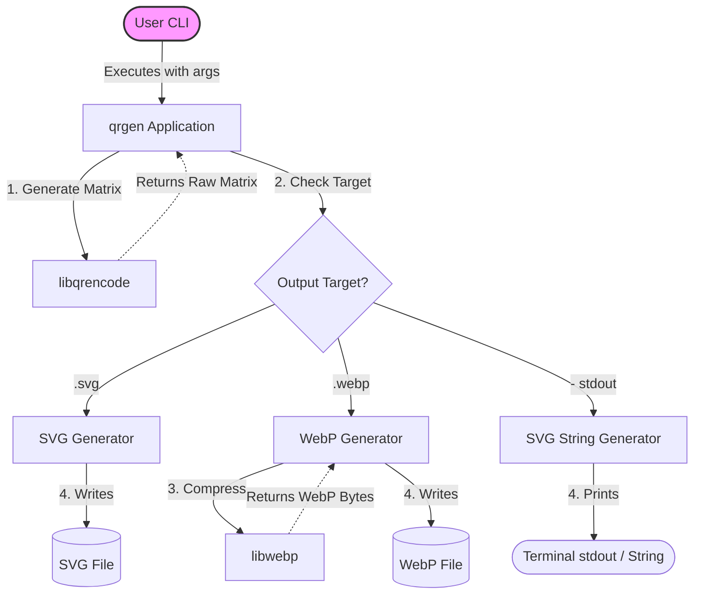

<div id="top" align="center">

<h1>QR Code Generator</h1>

<p>QR Code Generator (SVG & WebP - CLI & Header-only library)</p>

[Report Issue](https://github.com/Zheng-Bote/qr_generator/issues) · [Request Feature](https://github.com/Zheng-Bote/qr_generator/pulls)

[](https://choosealicense.com/licenses/mit/)

[](https://github.com/Zheng-Bote/qr_generator/releases)

</div>

---

<!-- START doctoc generated TOC please keep comment here to allow auto update -->
<!-- DON'T EDIT THIS SECTION, INSTEAD RE-RUN doctoc TO UPDATE -->
**Table of Contents**

  - [Description](#description)
  - [✨ Features](#-features)
  - [📂 Project Structure](#-project-structure)
  - [🛠️ Prerequisites](#-prerequisites)
  - [🚀 Building the Project](#-building-the-project)
    - [Generating a macOS Installer (.pkg)](#generating-a-macos-installer-pkg)
  - [💻 CLI Usage](#-cli-usage)
    - [Syntax:](#syntax)
      - [Examples](#examples)
  - [🧩 Using the Header-only Library in Your Code](#-using-the-header-only-library-in-your-code)
    - [CMakeLists.txt Example](#cmakeliststxt-example)
    - [C++ Example](#c-example)
      - [C++ Example (File Export)](#c-example-file-export)
      - [C++ Example (String Export)](#c-example-string-export)
  - [Architecture](#architecture)
    - [High-Level Flow Diagram](#high-level-flow-diagram)
- [📄 License](#-license)
  - [🤝 Authors](#-authors)
    - [Code Contributors](#code-contributors)

<!-- END doctoc generated TOC please keep comment here to allow auto update -->

---

## Description

A lightweight, modern C++23 **command-line tool** and **header-only library** for generating QR codes. It supports exporting to both vector (SVG) and lossless raster (WebP) formats.

The project requires zero manual dependency installation: it uses CMake's FetchContent to automatically download and statically link libqrencode and libwebp during the build process.

## ✨ Features

- **Dual Format Output**: Generate fully scalable .svg files or highly compressed, lossless .webp images based simply on the output file extension.
- **Direct String Output**: Generate raw SVG code directly to `stdout` or as a `std::string` in memory.
- **Custom Colors**: Support for custom hex-code foreground and background colors (including alpha/opacity).
- **Header-only Library**: The core logic is encapsulated in a single include/qr_generator.hpp file, making it trivial to drop into your own C++ projects.
- **Modern C++23**: Utilizes modern C++ features like std::format, std::filesystem, and std::ranges.

## 📂 Project Structure

```text
.
├── CMakeLists.txt         # Build script (handles fetching dependencies)
├── include/
│   └── qr_generator.hpp   # Core header-only library
└── src/
    └── main.cpp           # CLI wrapper
```

## 🛠️ Prerequisites

[]()
[]()

- A C++23 compatible compiler (GCC 13+, Clang 16+, or MSVC v143+)
- CMake 3.24 or higher

## 🚀 Building the Project

You don't need to install libqrencode or libwebp on your system. CMake will download them automatically.

```bash
# 1. Clone the repository (or navigate to the folder)
# git clone https://github.com/Zheng-Bote/qr_generator.git
cd qrgen

# 2. Create a build directory
mkdir build && cd build

# 3. Configure and build
cmake ..
cmake --build .
```

This will produce the qrgen executable in your build directory.

### Generating a macOS Installer (.pkg)

To create a native macOS `.pkg` installer, simply run `cpack` after building:

```bash
cd build
cpack -G productbuild
```

This will generate a file like `qrgen-0.2.0-Darwin.pkg` which can be installed via double-click or the `installer` command line utility.

## 💻 CLI Usage

The command-line tool automatically determines the output format based on your file extension (.svg or .webp).

### Syntax:

```bash
./qrgen "<text-or-url>" <output-file.[svg|webp]> [scale] [fg_hex] [bg_hex]
```

#### Examples

1. Basic SVG (Default black & white, scale 8):

```bash
./qrgen "https://github.com" github.svg
```

2. Larger WebP Image (Scale 15):

```bash
./qrgen "mailto:hello@example.com" contact.webp 15
```

3. Custom Colors (Red foreground FF0000, dark gray background 222222):

```bash
./qrgen "WIFI:S:MyNetwork;T:WPA;P:MyPassword;;" wifi.svg 10 FF0000 222222
```

4. return QR-Code as SVG-String:

```bash
./qrgen "Hello Terminal!" - 4 FF5500
```

## 🧩 Using the Header-only Library in Your Code

If you want to use the QR generator in your own application, just include the qr_generator.hpp file.

> [!NOTE]
> Because the underlying C libraries (libqrencode and libwebp) are not header-only, you must still link against them in your own CMakeLists.txt.

### CMakeLists.txt Example

```cmake
include(FetchContent)
FetchContent_Declare(
    qr_generator
    GIT_REPOSITORY https://github.com/ZHeng-Bote/qr_generator.git
    GIT_TAG        main
)
FetchContent_MakeAvailable(qr_generator)

add_executable(mein_programm main.cpp)
# Einfach gegen den Namespace linken!
target_link_libraries(mein_programm PRIVATE qr_generator::qr_generator)
```

### C++ Example

#### C++ Example (File Export)

```cpp
#include "qr_generator.hpp"
#include <iostream>

int main() {
    std::string text = "[https://www.robert.hase-zheng.net/](https://www.robert.hase-zheng.net/)";
    std::filesystem::path out = "my_landing-page.webp";

    // Scale 10, Dark Blue foreground, Light Yellow background
    qr::Color fg = {0, 0, 139, 255};
    qr::Color bg = {255, 255, 224, 255};

    if (qr::generate(text, out, 10, fg, bg)) {
        std::cout << "Successfully generated " << out << "!\n";
    } else {
        std::cerr << "Failed to generate QR code.\n";
    }

    return 0;
}
```

#### C++ Example (String Export)

```cpp
#include "qr_generator.hpp"
#include <iostream>

int main() {
    std::string text = "Direct to Memory";
    
    // Generates an SVG string directly without touching the filesystem
    auto svg_opt = qr::generate_svg_string(text, 8, {255, 0, 0, 255}); // Red QR

    if (svg_opt.has_value()) {
        std::cout << "Generated SVG Data:\n" << svg_opt.value() << "\n";
    }

    return 0;
}
```

## Architecture

The project follows a straightforward and maintainable architecture, designed to separate the encoding logic from the file I/O operations.

### High-Level Flow Diagram



---

# 📄 License

This project is licensed under the **MIT License**.

Copyright (c) 2026 ZHENG Robert

## 🤝 Authors

- [](https://www.github.com/Zheng-Bote)

### Code Contributors


[](https://www.github.com/Zheng-Bote)

---

Made with ❤️ and a lot of coffee. :vulcan_salute:
